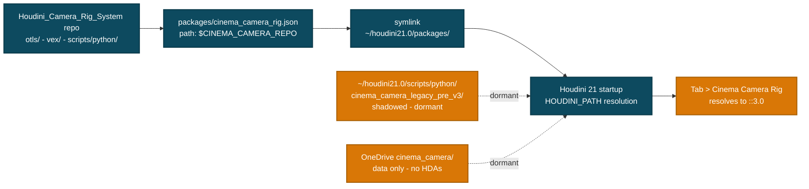
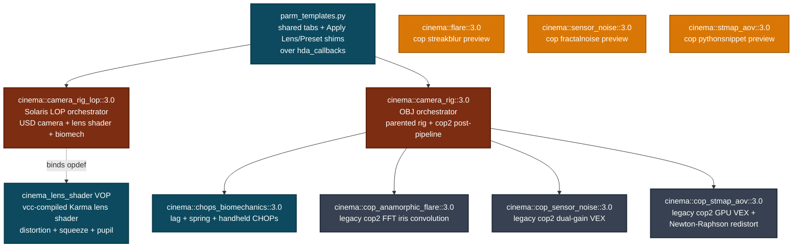
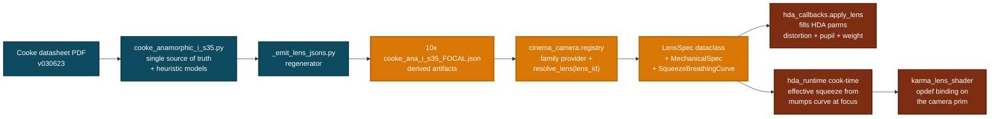

# Cinema Camera Rig

**Physically-grounded virtual cinematography for Houdini 21 Solaris.**

Authors USD camera rigs, binds Karma CVEX lens shaders, applies fluid-head biomechanics, and post-processes with Copernicus 2.0 — all driven by datasheet-authoritative cinema lens specifications.

> **Status (v3.4):** Lens registry wired into both rigs — `lens_id` now resolves to the JSON spec at cook time (focus-animated effective squeeze) and via the Apply Lens / Apply Preset callbacks (distortion, pupil offset, rig weight). Karma lens shader is REAL: `karma_cinema_lens.vfl` compiles to a `cinema_lens_shader` VOP via vcc and binds through `karma:camera:lensshader` (the attribute Karma actually consumes; CPU verified, XPU unverified). OBJ rig actually rigs: fluid_head → pupil_pivot → cam parenting, keyframable pan/tilt/roll targets filtered through the CHOP chain, correct meter units. LOP cook-time logic now lives in `cinema_camera.hda_runtime` (embedded scripts are shims). 69-assertion verify suite incl. OBJ↔LOP biomechanics step-response parity.

---

## What's in the box

- **Solaris-native LOP HDA** — `cinema::camera_rig_lop::3.0` authors a full nodal-parallax USD camera rig (`/CinemaRig/FluidHead/Body/Sensor/EntrancePupil`), binds the compiled Karma CVEX lens shader via `karma:camera:lensshader`, configures `RenderProduct` + `RenderSettings` (camera bound through the schema relationship), and runs a damped-spring biomechanics filter on the camera transform. All cook-time logic lives in `cinema_camera.hda_runtime` — the embedded Python Script LOPs are 8-line shims, so the pytest-covered package code is the shipping code.
- **OBJ orchestrator HDA** — `cinema::camera_rig::3.0` is a real rig: `fluid_head_mount → entrance_pupil_pivot → cinema_camera` object parenting puts the rotation pivot at the entrance pupil (camera hangs `pupil_offset/1000` m behind it). Keyframable `Target Pan/Tilt/Roll` parms on the Biomechanics tab feed the CHOP chain (lag → spring, ratio/frames converted to the CHOPs' native constant/seconds units) and the filtered result drives the fluid head via `chop()` pulls. Camera frustum on load, `Look Through Camera` button, nodal guide behind a toggle.
- **Karma lens shader VOP** — `cinema_lens_shader`, compiled from `vex/include/karma_cinema_lens.vfl` by `vcc -O vop` at build time. Brown-Conrady distortion + focus-dependent anamorphic squeeze + entrance-pupil ray origin, on the documented Karma lens-shader contract (matches Karma's standard projection when zeroed). Karma CPU verified; XPU lens-shader support unverified — the STMap AOV stays the renderer-agnostic route.
- **Copernicus 2.0 preview satellites** — `cinema::flare::3.0`, `cinema::sensor_noise::3.0`, `cinema::stmap_aov::3.0` — MVP ports of the legacy cop2 post-processing to native Copernicus 2.0 (cop category). Independent of the orchestrator for now; full-physics parity is on the roadmap.
- **10 Cooke Anamorphic/i S35 primes** — 25, 32, 40, 50, 65 Macro, 75, 100, 135, 180, 300mm — generated from PDF-authoritative spec data (datasheet version `030623`). Heuristic fields (entrance pupil offset, mumps curve, distortion) carry `_provenance` annotations marking exactly what to swap for fitted curves.
- **7 Cooke Anamorphic/i Full Frame Plus primes (skeleton)** — 25, 32, 40, 50, 75, 100, 135mm — 1.8x squeeze, 46mm image circle, for LF/VV/65mm bodies. PDF-verified focal lengths + squeeze + image circle + mount; mechanical fields (weight, length, T-stop range, MOD, gear specs) currently estimated and marked in `_provenance.estimated_datasheet_pending` until the official FF+ datasheet is pulled.
- **6 factory body presets** — ARRI ALEXA 35 (S35 narrative workhorse), ARRI ALEXA Mini LF (Roger Deakins's go-to since 2019), ARRI ALEXA 65 (Fraser/Sandgren prestige features), Sony VENICE 2 (dual-native ISO full frame), RED V-RAPTOR 8K VV (Vista Vision), Blackmagic URSA Cine 12K LF (12K large-format budget tier). Each preset auto-pairs body specs (sensor dims, resolution, ISO, weight) with the right Cooke anamorphic family (S35 for ALEXA 35, FF+ for the other five).
- **Override package descriptor** — symlinks into Houdini's `packages/` dir to make this repo authoritative without polluting `~/houdini21.0/scripts/python/`. Hot-reload friendly.
- **Procedural HDA builders** — pure Python under `scripts/python/cinema_camera/builders/`. Rebuild the entire 9-HDA pipeline from source via a one-line `rebuild_and_verify.py` driver, an in-Houdini builder import, or out-of-process Synapse.

---

## Install — for SideFX Houdini 21 users

### Prerequisites

- **SideFX Houdini 21.0** or newer (tested on `21.0.671` Apprentice / Indie / FX)
- **Windows 10/11** with PowerShell 5.1+ or PowerShell 7+ (`pwsh`)
- **Git** for the clone step
- *Recommended:* **Windows Developer Mode** enabled (Settings → Privacy & Security → For developers → Developer Mode = On). The installer prefers `SymbolicLink` over file copy when Developer Mode is on, which means future repo edits to the package descriptor hot-reload into Houdini with no re-install step.

### Step 1 — Clone the repo

```powershell
git clone https://github.com/JosephOIbrahim/Houdini_Camera_Rig_System.git C:\Houdini_Camera_Rig_System
cd C:\Houdini_Camera_Rig_System
```

You can clone anywhere; the installer detects the path automatically. Replace `C:\Houdini_Camera_Rig_System` with whatever location you prefer in the rest of the commands.

### Step 2 — Run the override-package installer

```powershell
.\scripts\install_package.ps1
```

The installer:

- **Pins `CINEMA_CAMERA_REPO` to this clone's path** — rewrites the value inside `packages/cinema_camera_rig.json` if it differs, so any clone location works (symlink hot-reload semantics preserved).
- Auto-detects your Houdini packages dir(s) — checks `~/houdini21.0/packages/` and the OneDrive-mirrored `~/OneDrive/Documents/houdini21.0/packages/`.
- Backs up any existing `cinema_camera_rig.json` to `cinema_camera_rig.json.bak.<timestamp>`.
- Symlinks (or copies, with a warning) `packages/cinema_camera_rig.json` and `packages/cinema_camera_rig.local.json` into each detected packages dir.
- The package descriptor sets `path: $CINEMA_CAMERA_REPO`, which makes Houdini auto-prepend `<repo>/otls/`, `<repo>/vex/include/`, and `<repo>/scripts/python/` to `HOUDINI_PATH` at startup.

Useful flags:

| Flag | Effect |
|---|---|
| `-ForceCopy` | Copy instead of symlink (use if symlinks fail and you don't want to enable Dev Mode). Trade-off: edits to the repo's package json won't auto-propagate. |
| `-Targets <path>[,<path>...]` | Install only into the specified package dir(s). |
| `-Uninstall` | Remove the installed files and restore the most recent `.bak` backup. Reversible. |

### Step 3 — Restart Houdini

Houdini parses the package descriptors at startup. After restarting, open the **Python Shell** (Windows → Python Shell) and verify:

```python
import os
print(os.environ.get("CINEMA_CAMERA_REPO"))
# -> C:\Houdini_Camera_Rig_System
```

If the value is `None`, Houdini didn't load the package — most commonly because Houdini was already running when the installer ran. Restart it.

### Step 4 — Drop the rig into a stage

**Solaris-native (recommended)** — in `/stage`:

1. **Tab → Cinema Camera Rig LOP** — creates `cinema::camera_rig_lop::3.0`.
2. Look at the parm panel — the first tab is **Preset** (six 2026 professional bodies). Pick one and click `Apply Preset` to bulk-fill body + lens parms; the remaining tabs (Lens / Distortion / Camera Body / Biomechanics / Post-Processing / Pipeline) become the override layer. `Look Through Camera` button + `Show Nodal Point Guide` toggle sit at the very top.
3. Click `Look Through Camera` — the Solaris viewport locks to `/CinemaRig/FluidHead/Body/Sensor`.
4. Try a focal length that didn't exist before this release: change `Lens ID` to `cooke_ana_i_s35_25mm` or `cooke_ana_i_ff_plus_135mm` and update the focal length to match.

**OBJ context** — in `/obj`:

1. **Tab → Cinema Camera Rig** — creates `cinema::camera_rig::3.0`.
2. Viewport draws a camera frustum at world origin (no yellow ring distracts on load).
3. Click `Look Through Camera` — viewport locks to the inner `cinema_camera` cam.
4. Keyframe `Target Pan/Tilt/Roll` on the Biomechanics tab for camera moves — the spring/lag filter drives the fluid head from them (the node transform is tripod placement). Toggle `Show Nodal Point Guide` to show the yellow ring at the rotation pivot = entrance pupil (the camera sits 12.5cm behind it at the default 125mm offset).

All 10 HDAs (9 operators + the `cinema_lens_shader` VOP) ship pre-built in `<repo>/otls/`, so no rebuild is needed for first use.

### Step 5 (optional) — End-to-end build + verify in one paste

```python
exec(open(r"C:\Houdini_Camera_Rig_System\scripts\rebuild_and_verify.py").read())
```

The driver:
- bootstraps `CINEMA_CAMERA_REPO` + `sys.path` if not already set,
- rebuilds all 10 HDAs from source, including the vcc-compiled lens shader VOP (Mile 1),
- reloads the live session (Mile 2),
- runs `verify_v3.py` end-to-end (Mile 3),
- prints a final tally (Mile 4).

Expected: **10/10 build** and **69 verify pass / 0 fail** across eight sections — operator-type registration, OBJ orchestrator cook, LOP USD prim authoring (incl. `karma:camera:lensshader` binding + RenderSettings camera relationship + pupil sign), biomechanics metadata + time samples, lens-registry loading, Copernicus 2.0 satellite registration, a v2-chain cook smoke test, and the section-[8] wiring/units/parity audit (ch() expression survival, OBJ parenting chain, pupil units, `resolve_lens` + Apply Lens, OBJ↔LOP biomechanics step-response parity). Scratch nodes (`/obj/__verify_v3_obj`, `/stage/__verify_v3_lop`, `/stage/__verify_v3_biomech`, `/stage/__verify_v3_biomech_src`, `/obj/__verify_v3_cop`) are left for inspection — destroy them when done.

To run verify alone without rebuilding:

```python
exec(open(r"C:\Houdini_Camera_Rig_System\scripts\verify_v3.py").read())
```

### Step 6 (optional) — Rebuild HDAs from source

`rebuild_and_verify.py` is the canonical path. Alternatives:

```python
# In-Houdini direct, no verify:
from cinema_camera.builders.build_all import build_all_v3
build_all_v3()
```

Out-of-process via Synapse (server must be running on `:9999`):

```bash
python C:\Houdini_Camera_Rig_System\scripts\python\cinema_camera\builders\_rebuild_all_hdas.py
```

For a heavier reset that also clears shadowed legacy installs:

```python
exec(open(r"C:\Houdini_Camera_Rig_System\scripts\bootstrap_v3_build.py").read())
```

### Troubleshooting

| Symptom | Fix |
|---|---|
| `CINEMA_CAMERA_REPO` is `None` after Houdini restart | Re-run installer; confirm `~/houdini21.0/packages/cinema_camera_rig.json` exists and resolves (target file present). |
| `ModuleNotFoundError: cinema_camera.builders.build_all` | A pre-existing `~/houdini21.0/scripts/python/cinema_camera/` is shadowing the repo. Run `bootstrap_v3_build.py` (handles this automatically), or rename the shadow: `os.rename(r"C:\Users\You\houdini21.0\scripts\python\cinema_camera", r"C:\Users\You\houdini21.0\scripts\python\cinema_camera_legacy")`. |
| Symlink creation fails during install | Enable Windows Developer Mode (no admin needed) or re-run with `.\scripts\install_package.ps1 -ForceCopy`. |
| `Tab > Cinema Camera Rig LOP` not in menu | Confirm `<repo>/otls/cinema_camera_rig_lop_3.0.hda` exists and is loaded: `print([f for f in hou.hda.loadedFiles() if "Camera_Rig_System" in f])` should include the ten v3 entries (3 legacy cop2 + 3 cop preview + chops_biomechanics + lens shader VOP + LOP + OBJ orchestrators). If empty, restart Houdini. |
| Want Wolfram-fitted lens curves | Edit `packages/cinema_camera_rig.local.json` and put your App ID in `WOLFRAM_APP_ID` (get one free at https://account.wolfram.com/me/apps). The fit pipeline currently has an asyncio bug — see roadmap. |

---

## Architecture: how the override package wins over your existing install



The package descriptor's `path: $CINEMA_CAMERA_REPO` makes Houdini auto-prepend `<repo>/otls/`, `<repo>/vex/include/`, and `<repo>/scripts/python/` to its scan paths. Symlinking the descriptor (vs. copying) means future repo edits to the package json hot-reload — no re-install needed.

---

## How the LOP rig builds a USD camera

`cinema::camera_rig_lop::3.0` is a chain of Python Script LOPs — each an 8-line shim over `cinema_camera.hda_runtime`, so the pytest-covered package code is what cooks. Each authors a slice of the USD stage:

```mermaid
flowchart LR
    PARMS["HDA parameter interface<br/>Look Through + Apply Lens + presets<br/>Preset tab + 6 tabs"]:::primary

    BR["build_camera_rig<br/>shim: hda_runtime.author_camera_rig<br/>Xform hierarchy + camera attrs"]:::primary
    BM["apply_biomechanics<br/>shim: hda_runtime.apply_biomechanics<br/>spring/lag solver + handheld shake"]:::primary
    LS["bind_lens_shader<br/>shim: hda_runtime.author_lens_shader<br/>karma lensshader opdef binding"]:::primary
    RP["render_product<br/>shim: hda_runtime.author_render_product<br/>Cooke i + ASWF EXR headers"]:::primary
    RS["render_settings<br/>shim: hda_runtime.author_render_settings<br/>resolution + camera relationship"]:::primary

    USD["/CinemaRig USD stage/<br/>FluidHead/Body/Sensor/<br/>EntrancePupil + lensshader attrs<br/>/Render/Products + Settings"]:::accent

    PARMS --> BR
    BR --> BM
    BM --> LS
    LS --> RP
    RP --> RS
    RS --> USD

    classDef primary fill:#0d4a5f,stroke:#0a3a4a,color:#fff,stroke-width:2px
    classDef accent  fill:#d97706,stroke:#a85f04,color:#fff,stroke-width:2px
```



The `apply_biomechanics` LOP runs the damped-spring ODE (`x'' = -k(x - target_lagged) - c·x'`, `c = 2√k·ζ`) over `hou.playbar.frameRange()` and writes per-frame USD time samples on `/CinemaRig/FluidHead`'s `xformOp:rotateXYZ`. Procedural handheld shake (deterministic sin-sum with phase offsets) layers on top. Solver state is preserved as `cinema:rig:biomech:*` metadata attrs for downstream introspection.

---

## The 10-HDA pipeline

Two orchestrators, three legacy cop2 satellites (consumed by the OBJ orchestrator), three Copernicus 2.0 preview satellites (independent, currently MVP), one CHOPs biomechanics sub-HDA, and the vcc-compiled `cinema_lens_shader` VOP (bound by the LOP rig) — all driven by the same shared parm template.



The Copernicus 2.0 preview satellites (orange) are **deliberately disconnected** from the orchestrator. They register in the `cop` category, cook cleanly, and are usable standalone — but they're MVP ports that haven't yet reached parity with the legacy cop2 stack (no GPU VEX, no Newton-Raphson redistort, no signal-dependent shot noise). Migration of the orchestrator to consume them happens when the missing physics is ported via Copernicus `vopnet+snippet`.

---

## Camera body presets (six 2026 professional cinema rigs)

| # | Body | Format | Native res | Sensor (mm) | Native ISO | Rig wt | Cooke line | Color science |
|---|------|--------|------------|-------------|------------|--------|------------|---------------|
| 1 | ARRI ALEXA 35           | S35       | 4608 × 3164  | 27.99 × 19.22 | 800        | 3.9 kg  | S35 (2.0×)   | ARRI LogC4               |
| 2 | ARRI ALEXA Mini LF      | LF        | 4448 × 3096  | 36.70 × 25.54 | 800        | 3.5 kg  | FF+ (1.8×)   | ARRI LogC3               |
| 3 | ARRI ALEXA 65           | 65mm      | 6560 × 3102  | 54.12 × 25.58 | 800        | 11.2 kg | FF+ (1.8×)   | ARRI LogC3               |
| 4 | Sony VENICE 2           | FF        | 8640 × 5760  | 35.90 × 24.00 | 800 / 3200 | 4.5 kg  | FF+ (1.8×)   | Sony S-Log3 S-Gamut3.Cine |
| 5 | RED V-RAPTOR 8K VV      | VV (17:9) | 8192 × 4320  | 40.96 × 21.60 | 800        | 2.5 kg  | FF+ (1.8×)   | REDWideGamutRGB / Log3G10 |
| 6 | Blackmagic URSA Cine 12K LF | LF    | 12288 × 8064 | 36.00 × 24.00 | 800        | 4.5 kg  | FF+ (1.8×)   | Blackmagic Wide Gamut Gen 5 |

Rig weight is the *operational* mass (body + EVF + battery + handles) used by the biomechanics solver's auto-derive — heavier rigs get higher damping ratios and more lag. ALEXA 65 at 11.2 kg yields a noticeably more inertial feel than the RED V-RAPTOR at 2.5 kg.

The preset is applied via the **Preset** tab at the front of the HDA's parm panel: pick a camera in the dropdown, click **Apply Preset**, and `body_id`, `sensor_*_mm`, `resolution_*`, `native_iso`, `exposure_index`, `combined_weight_kg`, `focal_length_mm`, `t_stop`, `squeeze_ratio`, `effective_squeeze`, and `lens_id` bulk-fill from `cinema_camera.presets.CAMERA_PRESETS` (the single source of truth, also used by offline Python tooling).

Body specs are also addressable from the Python API:

```python
from cinema_camera.registry import get_body, list_bodies
print(list_bodies())
# ['arri_alexa_35', 'arri_alexa_65', 'arri_alexa_mini_lf',
#  'blackmagic_ursa_cine_12k_lf', 'red_v_raptor_8k_vv', 'sony_venice_2']
state = get_body("arri_alexa_mini_lf")  # CameraState dataclass instance
```

---

## Cooke Anamorphic/i S35 lens registry

All 10 primes from the official datasheet (`COOKE_Anamorphic-i-S35_Specification_030623.pdf`):

| Focal | T-stop | MOD | Length | Front Ø | Weight | Filter |
|---|---|---|---|---|---|---|
| 25mm * | T2.3–T22 | 1.000 m | 204 mm | 136 mm | 4.2 kg | M131×0.75 |
| 32mm | T2.3–T22 | 0.850 m | 198 mm | 110 mm | 3.2 kg | — |
| 40mm | T2.3–T22 | 0.850 m | 205 mm | 110 mm | 3.4 kg | M105×0.75 |
| 50mm | T2.3–T22 | 0.850 m | 205 mm | 110 mm | 3.6 kg | M105×0.75 |
| 65mm Macro * | T2.6–T22 | 0.440 m | 266 mm | 136 mm | 5.2 kg | M131×0.75 |
| 75mm | T2.3–T22 | 1.000 m | 205 mm | 110 mm | 3.2 kg | M105×0.75 |
| 100mm | T2.3–T22 | 1.200 m | 205 mm | 110 mm | 3.4 kg | M105×0.75 |
| 135mm * | T2.3–T22 | 1.400 m | 240 mm | 110 mm | 4.2 kg | M105×0.75 |
| 180mm * | T2.8–T22 | 2.000 m | 302 mm | 110 mm | 5.8 kg | M105×0.75 |
| 300mm * | T3.5–T22 | 3.000 m | 381 mm | 136 mm | 9.4 kg | M131×0.75 |

\* Supplied with support bracket. All primes share: 2.0× squeeze, 31.1mm image circle, 300° focus rotation (140-tooth 0.8-module gear), 90° iris rotation (134-tooth 0.8-module gear), PL or LPL mount.

### How lens data flows



PDF-authoritative fields: focal length, T-stop range, MOD, length, front Ø, weight, filter thread, gear specs, image circle, squeeze ratio.

Heuristic fields (Cooke does not publish these — replace via Wolfram fits when ready): entrance pupil offset (`length × 0.5`), squeeze breathing curve (`deficit ∝ √(50/focal)`), distortion coefficients (`k1 ∝ -0.020 √(50/focal)`), squeeze uniformity. Each heuristic carries a `_provenance` annotation in the JSON so the model used is explicit.

### Cooke Anamorphic/i Full Frame Plus (FF+) — skeleton

A sibling line for full-frame and larger sensors (LF, Vista Vision, 65mm). Source: `scripts/python/cinema_camera/lenses/cooke_anamorphic_i_ff_plus.py`. The 7 emitted JSONs (`cooke_ana_i_ff_plus_25mm.json` through `_135mm.json`) currently encode:

- **PDF-authoritative:** `manufacturer`, `series`, `focal_length_mm`, `squeeze_ratio` (1.8×), `image_circle_mm` (46), `mount` (PL or LPL).
- **Estimated, datasheet pending:** T-stop range, MOD, weight, length, front Ø, filter thread, gear specs, FOV reference. Listed under `_provenance.estimated_datasheet_pending` in each JSON.
- **Heuristic models** mirror the S35 family but with reduced coefficients (FF+ optics are flatter; deficit coefficient 0.10 vs S35's 0.15; distortion k1 −0.015 vs S35's −0.020). Reasoning lives in `_provenance.heuristic`.

Re-emit JSONs from the Python source after editing:

```bash
python scripts/python/cinema_camera/lenses/_emit_lens_jsons.py --family ff_plus
```

When the official Cooke FF+ datasheet PDF is retrieved, swap the estimated values into the Python source and re-emit — the same workflow that built the S35 registry from `COOKE_Anamorphic-i-S35_Specification_030623.pdf`.

---

## Daily-driver workflow

In Houdini's Python shell after install + restart:

```python
# Build all 9 HDAs + reload + verify, in one paste:
exec(open(r"C:\Users\You\Houdini_Camera_Rig_System\scripts\rebuild_and_verify.py").read())

# Or just build (no verify):
from cinema_camera.builders.build_all import build_all_v3
build_all_v3()

# Or just verify (no rebuild):
exec(open(r"C:\Users\You\Houdini_Camera_Rig_System\scripts\verify_v3.py").read())

# Use a brand-new focal length
import os
from pathlib import Path
from cinema_camera.registry import get_lens
spec = get_lens("cooke_ana_i_s35",
                Path(os.environ["CINEMA_CAMERA_REPO"]) /
                "cinema_camera" / "lenses" / "cooke_ana_i_s35_25mm.json")
print(f"{spec.lens_id}: f={spec.focal_length_mm}mm, T{spec.t_stop_min}-{spec.t_stop_max}")
```

Out-of-Houdini (Synapse driver, build via WebSocket from any terminal):

```bash
python C:\Users\You\Houdini_Camera_Rig_System\scripts\python\cinema_camera\builders\_rebuild_all_hdas.py
```

---

## Repo layout

```
Houdini_Camera_Rig_System/
├── otls/                          ← 10x v3 HDAs (Houdini auto-loaded)
│   ├── cinema_camera_rig_3.0.hda            (OBJ orchestrator, parented rig)
│   ├── cinema_camera_rig_lop_3.0.hda        (Solaris-native primary)
│   ├── cinema_lens_shader.hda               (vcc-compiled Karma lens shader VOP)
│   ├── cinema_chops_biomechanics_3.0.hda    (lag/spring/shake CHOPs)
│   ├── cinema_cop_{anamorphic_flare,sensor_noise,stmap_aov}_3.0.hda  (legacy cop2 stack)
│   └── cinema_{flare,sensor_noise,stmap_aov}_3.0.hda                 (Copernicus 2.0 preview)
├── vex/include/                   ← Karma CVEX shader + optics header
│   ├── karma_cinema_lens.vfl      (H21 Karma lens-shader contract; vcc source)
│   └── libcinema_optics.h
├── scripts/python/cinema_camera/  ← Python package (auto-importable)
│   ├── protocols.py               (typed dataclasses + ENTRANCE_PUPIL_Z_SIGN convention)
│   ├── biomechanics.py            (auto-derive formulas + spring/shake solvers, single source)
│   ├── registry.py                (lens/body providers + resolve_lens(lens_id))
│   ├── hda_runtime.py             (LOP cook-time logic; embedded scripts are shims over this)
│   ├── hda_callbacks.py           (Apply Lens/Preset, focal & focus & handheld callbacks)
│   ├── karma_lens_shader.py       (karma:camera:lensshader opdef binding)
│   ├── usd_builder.py             (pure-pxr USD authoring: rig, product, settings)
│   ├── lenses/
│   │   ├── cooke_anamorphic_i_s35.py        (PDF source of truth)
│   │   ├── cooke_anamorphic_i_ff_plus.py    (FF+ skeleton source)
│   │   ├── cooke_anamorphic.py              (JSON loader / provider)
│   │   └── _emit_lens_jsons.py              (regenerator)
│   ├── bodies/                    (6x 2026 cinema body providers)
│   └── builders/                  ← 10 HDA builders + drivers
│       ├── parm_templates.py                (shared tabs; callbacks shim to hda_callbacks)
│       ├── build_lens_shader_vop.py         (vcc -O vop compile + section assert)
│       ├── build_camera_rig_orchestrator.py
│       ├── build_camera_rig_lop.py
│       ├── build_chops_biomechanics.py
│       ├── build_cop_{anamorphic_flare,sensor_noise,stmap_aov}.py   (legacy cop2)
│       ├── build_cop_{flare,sensor_noise,stmap_aov}_v2.py            (Copernicus 2.0 preview)
│       ├── build_all.py                     (in-Houdini build driver)
│       └── _rebuild_all_hdas.py             (Synapse out-of-process driver)
├── packages/
│   ├── cinema_camera_rig.json     (override package descriptor; installer pins repo path)
│   └── cinema_camera_rig.local.json.example  (template; live file gitignored)
├── cinema_camera/                 ← project data
│   ├── lenses/                    (17x PDF-derived JSONs + schema: 10 S35 + 7 FF+)
│   ├── hda/                       (legacy v2.0 HDAs for back-compat)
│   ├── tests/                     (pytest suite, 74 tests; runs under hython)
│   └── examples/                  (build_focus_pull_example.py + .hip)
└── scripts/                       ← top-level utilities
    ├── install_package.ps1            (symlink installer + repo-path pinning)
    ├── rebuild_and_verify.py          (single-paste build + reload + verify driver)
    ├── bootstrap_v3_build.py          (heavier reset + rebuild, clears legacy shadows)
    ├── verify_v3.py                   (8-section, 69-assertion end-to-end checker)
    └── probe_copernicus.py            (Copernicus type/category diagnostic)
```

Project-private docs (architecture spec, Wolfram amendment, setup notes, agent-team handoff) live under `cinema_camera/*.md`.

---

## Status & roadmap

- [x] **Override package** — repo authoritative, dual-path sync killed
- [x] **PDF-grounded lens registry** — 10 Cooke primes generated from datasheet
- [x] **v3.0 HDA pipeline** — 9 HDAs versioned, sub-HDA wiring resolved (sees `::3.0`)
- [x] **Solaris-native USD camera authoring** — full `/CinemaRig/FluidHead/...` hierarchy + Karma shader binding + RenderProduct/RenderSettings
- [x] **Biomechanics in LOP context** — damped-spring solver + procedural handheld shake authored as USD time samples
- [x] **Copernicus 2.0 post-processing preview** — `cinema::{flare,sensor_noise,stmap_aov}::3.0` registered in the `cop` category; cook clean; standalone usable. Full physics parity (dual-gain VEX, GPU redistort, FFT iris) deferred to `vopnet+snippet` migration.
- [x] **Unified CineCamera UX** — both OBJ and LOP rigs now display a camera frustum on load, expose a `Look Through Camera` button at the top of the parm panel, and gate the nodal-point guide behind a `Show Nodal Point Guide` toggle.
- [x] **Single-paste build + verify driver** — `scripts/rebuild_and_verify.py` covers env bootstrap → build → reload → 7-section verify → tally in one exec.
- [x] **Lens registry wired into the rigs** — `registry.resolve_lens(lens_id)` + Apply Lens / Apply Preset callbacks (`cinema_camera.hda_callbacks`) + cook-time effective squeeze from the lens's mumps curve (`cinema_camera.hda_runtime`).
- [x] **Karma lens shader real** — vcc-compiled `cinema_lens_shader` VOP bound via `karma:camera:lensshader` opdef (format verified against what the 21.0.729 Camera LOP authors). RenderSettings camera bound through the schema relationship.
- [x] **OBJ rig parented + CHOP-driven** — pivot at the entrance pupil, keyframable targets, lag/spring with correct unit conversions, verified by a step-response parity test against the LOP solver.
- [x] **Parm-wiring audit** — `verify_v3.py` section [8]: ch() expression survival, parenting chain, pupil units, lens resolve/apply, OBJ↔LOP biomech parity.
- [ ] **Copernicus 2.0 full-physics port** — port dual-gain noise VEX + GPU STMap + FFT iris flare into `vopnet+snippet` so the orchestrator can swap legacy cop2 → cop without losing features.
- [ ] **Karma XPU lens-shader verification** — render a distortion wedge through Karma CPU and XPU and diff; if XPU ignores `karma:camera:lensshader`, document the STMap AOV as the XPU route.
- [ ] **Wolfram-fitted curves** — replace heuristic squeeze breathing / pupil shift / distortion with ODE-fitted curves (W2-W5; the asyncio conflict is already patched via sync httpx in `wolfram_oracle.py`).
- [ ] **Refresh example .hip** — current `examples/cinema_rig_focus_pull_example.hip` references the v2.0 OBJ rig; regenerate with v3.0 LOP + a new focal length.

The OBJ orchestrator (`cinema::camera_rig::3.0`) is no longer treated as deprecated — the v3.1 UX work brought its in-viewport behavior to parity with what a Maya/Unreal user would expect from a CineCamera-style node. The Solaris LOP rig (`cinema::camera_rig_lop::3.0`) is still the canonical path for new USD-first workflows; the OBJ rig is the right choice for /obj-context, Mantra-era, or back-compat scenes.

---

## Lineage

| Version | Notes |
|---|---|
| v3.4 | First-principles cohesion release: lens registry wired into both rigs (resolve_lens + Apply Lens/Preset callbacks + cook-time mumps); Karma lens shader compiled (vcc → cinema_lens_shader VOP) and bound via karma:camera:lensshader; RenderSettings camera as relationship; OBJ rig parented (pivot at entrance pupil, /1000 unit fix) with keyframable pan/tilt/roll targets driving the CHOP chain (lag s / damping-constant conversions fixed); entrance-pupil sign unified (−Z toward scene, protocols.ENTRANCE_PUPIL_Z_SIGN); LOP embedded scripts became shims over cinema_camera.hda_runtime; auto-derive formulas single-sourced in biomechanics.py; verify section [8] (69 assertions total) incl. OBJ↔LOP step-response parity. |
| v3.3 | Artist-friendly parm UX: Common-prime focal length dropdown on Lens tab; Shutter Angle (deg) wired to cam shutter + USD shutterOpen/Close; "Show Advanced (Brown-Conrady)" toggle hides raw K1-P2 distortion coefficients on the Distortion tab; Handheld Style menu (Tripod / Steadicam / Operator / Handheld / Verite) on Biomechanics tab with auto-fill callback; spring/damping/lag/shake parms now hide when Auto-Derive is on. |
| v3.2 | Six 2026 professional camera body presets (ARRI ALEXA 35 / Mini LF / 65, Sony VENICE 2, RED V-RAPTOR 8K VV, Blackmagic URSA Cine 12K LF); Cooke Anamorphic/i Full Frame Plus (FF+) skeleton lens family; "Preset" tab at front of HDA parm panel with single-click Apply |
| v3.1 | Copernicus 2.0 preview satellites shipping; unified CineCamera UX (camera frustum on load, Look Through button, toggleable nodal guide); single-paste `rebuild_and_verify.py` driver; 38-assertion verify suite |
| v3.0 | Repo-authoritative override; PDF-grounded Cooke lineup; Solaris-native LOP rig with biomechanics; HDA type-name versioning fix |
| v2.0 | OBJ-context orchestrator + 4 satellite HDAs; lived in OneDrive `houdini21.0/`; dual-path sync required |
| v4.0 spec | Project specification (Physical Architecture + Synapse Refactor + Wolfram Amendment) under `cinema_camera/CINEMA_CAMERA_RIG_v4_*.md` |

---

## License

MIT — see [`LICENSE`](LICENSE). Copyright © 2026 Joseph Ibrahim.

For the agent-team handoff document and detailed Synapse protocol notes, see [`cinema_camera/CLAUDE.md`](cinema_camera/CLAUDE.md).
