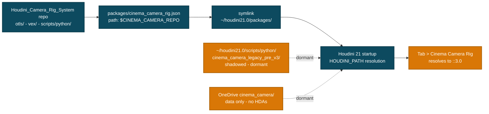

# Cinema Camera Rig

**Physically-grounded virtual cinematography for Houdini 21 Solaris.**

Authors USD camera rigs, binds Karma CVEX lens shaders, applies fluid-head biomechanics, and post-processes with Copernicus 2.0 — all driven by datasheet-authoritative cinema lens specifications.

> **Status (v3.0):** Override package live. Solaris-native LOP rig with biomechanics filter shipping. 10-prime Cooke Anamorphic/i S35 registry derived directly from the official Cooke datasheet. Copernicus 2.0 post-processing in progress.

---

## What's in the box

- **Solaris-native LOP HDA** — `cinema::camera_rig_lop::3.0` authors a full nodal-parallax USD camera rig (`/CinemaRig/FluidHead/Body/Sensor/EntrancePupil`), binds a Karma CVEX lens shader, configures `RenderProduct` + `RenderSettings`, and runs a damped-spring biomechanics filter on the camera transform.
- **10 Cooke Anamorphic/i S35 primes** — 25, 32, 40, 50, 65 Macro, 75, 100, 135, 180, 300mm — generated from PDF-authoritative spec data (datasheet version `030623`). Heuristic fields (entrance pupil offset, mumps curve, distortion) carry `_provenance` annotations marking exactly what to swap for fitted curves.
- **Override package descriptor** — symlinks into Houdini's `packages/` dir to make this repo authoritative without polluting `~/houdini21.0/scripts/python/`. Hot-reload friendly.
- **Procedural HDA builders** — pure Python under `scripts/python/cinema_camera/builders/`. Rebuild the entire 6-HDA pipeline from source via in-Houdini one-liner or out-of-process Synapse driver.

---

## Install — for SideFX Houdini 21 users

### Prerequisites

- **SideFX Houdini 21.0** or newer (tested on `21.0.671` Apprentice / Indie / FX)
- **Windows 10/11** with PowerShell 5.1+ or PowerShell 7+ (`pwsh`)
- **Git** for the clone step
- *Recommended:* **Windows Developer Mode** enabled (Settings → Privacy & Security → For developers → Developer Mode = On). The installer prefers `SymbolicLink` over file copy when Developer Mode is on, which means future repo edits to the package descriptor hot-reload into Houdini with no re-install step.

### Step 1 — Clone the repo

```powershell
git clone https://github.com/JosephOIbrahim/Houdini_Camera_Rig_System.git C:\Houdini_Camera_Rig_System
cd C:\Houdini_Camera_Rig_System
```

You can clone anywhere; the installer detects the path automatically. Replace `C:\Houdini_Camera_Rig_System` with whatever location you prefer in the rest of the commands.

### Step 2 — Run the override-package installer

```powershell
.\scripts\install_package.ps1
```

The installer:

- Auto-detects your Houdini packages dir(s) — checks `~/houdini21.0/packages/` and the OneDrive-mirrored `~/OneDrive/Documents/houdini21.0/packages/`.
- Backs up any existing `cinema_camera_rig.json` to `cinema_camera_rig.json.bak.<timestamp>`.
- Symlinks (or copies, with a warning) `packages/cinema_camera_rig.json` and `packages/cinema_camera_rig.local.json` into each detected packages dir.
- The package descriptor sets `path: $CINEMA_CAMERA_REPO`, which makes Houdini auto-prepend `<repo>/otls/`, `<repo>/vex/include/`, and `<repo>/scripts/python/` to `HOUDINI_PATH` at startup.

Useful flags:

| Flag | Effect |
|---|---|
| `-ForceCopy` | Copy instead of symlink (use if symlinks fail and you don't want to enable Dev Mode). Trade-off: edits to the repo's package json won't auto-propagate. |
| `-Targets <path>[,<path>...]` | Install only into the specified package dir(s). |
| `-Uninstall` | Remove the installed files and restore the most recent `.bak` backup. Reversible. |

### Step 3 — Restart Houdini

Houdini parses the package descriptors at startup. After restarting, open the **Python Shell** (Windows → Python Shell) and verify:

```python
import os
print(os.environ.get("CINEMA_CAMERA_REPO"))
# -> C:\Houdini_Camera_Rig_System
```

If the value is `None`, Houdini didn't load the package — most commonly because Houdini was already running when the installer ran. Restart it.

### Step 4 — Drop the rig into a Solaris stage

In any LOP context (the default `/stage`):

1. **Tab → Cinema Camera Rig LOP** — creates `cinema::camera_rig_lop::3.0`.
2. Look at the **Lens** tab — the `Lens ID`, focal length, T-stop, focus, and squeeze parms are wired.
3. Try a focal length that didn't exist before this release: change `Lens ID` to `cooke_ana_i_s35_25mm` or `cooke_ana_i_s35_180mm` and update the focal length to match.
4. The 6 HDAs ship pre-built in `<repo>/otls/`, so no rebuild is needed for first use.

### Step 5 (optional) — End-to-end verification

```python
exec(open(r"C:\Houdini_Camera_Rig_System\scripts\verify_v3.py").read())
```

Expected: ~25 `[PASS]` lines covering operator-type registration, sub-HDA wiring (`::3.0` resolution), USD prim authoring, biomechanics metadata + time samples, and lens-registry loading. The script leaves three test nodes (`/obj/__verify_v3_obj`, `/stage/__verify_v3_lop`, `/stage/__verify_v3_biomech`) for manual inspection — destroy them when done.

### Step 6 (optional) — Rebuild HDAs from source

If you edit any builder under `scripts/python/cinema_camera/builders/`, paste this into the Houdini Python shell. It uninstalls the old HDA registrations, force-loads the repo's `cinema_camera/`, and rebuilds + reinstalls all 6 HDAs:

```python
exec(open(r"C:\Houdini_Camera_Rig_System\scripts\bootstrap_v3_build.py").read())
```

Or rebuild out-of-process via Synapse (Synapse server must be running on `:9999`):

```bash
python C:\Houdini_Camera_Rig_System\scripts\python\cinema_camera\builders\_rebuild_all_hdas.py
```

### Troubleshooting

| Symptom | Fix |
|---|---|
| `CINEMA_CAMERA_REPO` is `None` after Houdini restart | Re-run installer; confirm `~/houdini21.0/packages/cinema_camera_rig.json` exists and resolves (target file present). |
| `ModuleNotFoundError: cinema_camera.builders.build_all` | A pre-existing `~/houdini21.0/scripts/python/cinema_camera/` is shadowing the repo. Run `bootstrap_v3_build.py` (handles this automatically), or rename the shadow: `os.rename(r"C:\Users\You\houdini21.0\scripts\python\cinema_camera", r"C:\Users\You\houdini21.0\scripts\python\cinema_camera_legacy")`. |
| Symlink creation fails during install | Enable Windows Developer Mode (no admin needed) or re-run with `.\scripts\install_package.ps1 -ForceCopy`. |
| `Tab > Cinema Camera Rig LOP` not in menu | Confirm `<repo>/otls/cinema_camera_rig_lop_3.0.hda` exists and is loaded: `print([f for f in hou.hda.loadedFiles() if "Camera_Rig_System" in f])` should show six entries. If empty, restart Houdini. |
| Want Wolfram-fitted lens curves | Edit `packages/cinema_camera_rig.local.json` and put your App ID in `WOLFRAM_APP_ID` (get one free at https://account.wolfram.com/me/apps). The fit pipeline currently has an asyncio bug — see roadmap. |

---

## Architecture: how the override package wins over your existing install



The package descriptor's `path: $CINEMA_CAMERA_REPO` makes Houdini auto-prepend `<repo>/otls/`, `<repo>/vex/include/`, and `<repo>/scripts/python/` to its scan paths. Symlinking the descriptor (vs. copying) means future repo edits to the package json hot-reload — no re-install needed.

---

## How the LOP rig builds a USD camera

`cinema::camera_rig_lop::3.0` is a chain of Python Script LOPs. Each authors a slice of the USD stage:

```mermaid
flowchart LR
    PARMS[HDA parameter interface<br/>6 tabs - 42 parms]:::primary

    BR[build_camera_rig<br/>Xform hierarchy<br/>+ camera attrs]:::primary
    BM[apply_biomechanics<br/>spring/lag solver<br/>+ handheld shake]:::primary
    LS[bind_lens_shader<br/>Karma CVEX shader<br/>+ distortion inputs]:::primary
    RP[render_product<br/>Cooke i metadata<br/>+ ASWF EXR headers]:::primary
    RS[render_settings<br/>resolution + camera<br/>+ Karma XPU config]:::primary

    USD[/CinemaRig USD stage/<br/>FluidHead/Body/Sensor/<br/>EntrancePupil + CinemaLensShader<br/>/Render/Products + Settings]:::accent

    PARMS --> BR
    BR --> BM
    BM --> LS
    LS --> RP
    RP --> RS
    RS --> USD

    classDef primary fill:#0d4a5f,stroke:#0a3a4a,color:#fff,stroke-width:2px
    classDef accent  fill:#d97706,stroke:#a85f04,color:#fff,stroke-width:2px
```

The `apply_biomechanics` LOP runs the damped-spring ODE (`x'' = -k(x - target_lagged) - c·x'`, `c = 2√k·ζ`) over `hou.playbar.frameRange()` and writes per-frame USD time samples on `/CinemaRig/FluidHead`'s `xformOp:rotateXYZ`. Procedural handheld shake (deterministic sin-sum with phase offsets) layers on top. Solver state is preserved as `cinema:rig:biomech:*` metadata attrs for downstream introspection.

---

## Cooke Anamorphic/i S35 lens registry

All 10 primes from the official datasheet (`COOKE_Anamorphic-i-S35_Specification_030623.pdf`):

| Focal | T-stop | MOD | Length | Front Ø | Weight | Filter |
|---|---|---|---|---|---|---|
| 25mm * | T2.3–T22 | 1.000 m | 204 mm | 136 mm | 4.2 kg | M131×0.75 |
| 32mm | T2.3–T22 | 0.850 m | 198 mm | 110 mm | 3.2 kg | — |
| 40mm | T2.3–T22 | 0.850 m | 205 mm | 110 mm | 3.4 kg | M105×0.75 |
| 50mm | T2.3–T22 | 0.850 m | 205 mm | 110 mm | 3.6 kg | M105×0.75 |
| 65mm Macro * | T2.6–T22 | 0.440 m | 266 mm | 136 mm | 5.2 kg | M131×0.75 |
| 75mm | T2.3–T22 | 1.000 m | 205 mm | 110 mm | 3.2 kg | M105×0.75 |
| 100mm | T2.3–T22 | 1.200 m | 205 mm | 110 mm | 3.4 kg | M105×0.75 |
| 135mm * | T2.3–T22 | 1.400 m | 240 mm | 110 mm | 4.2 kg | M105×0.75 |
| 180mm * | T2.8–T22 | 2.000 m | 302 mm | 110 mm | 5.8 kg | M105×0.75 |
| 300mm * | T3.5–T22 | 3.000 m | 381 mm | 136 mm | 9.4 kg | M131×0.75 |

\* Supplied with support bracket. All primes share: 2.0× squeeze, 31.1mm image circle, 300° focus rotation (140-tooth 0.8-module gear), 90° iris rotation (134-tooth 0.8-module gear), PL or LPL mount.

### How lens data flows

```mermaid
flowchart LR
    PDF[Cooke datasheet PDF<br/>v030623]:::primary
    SRC[cooke_anamorphic_i_s35.py<br/>single source of truth<br/>+ heuristic models]:::primary
    EMIT[_emit_lens_jsons.py<br/>regenerator]:::primary

    JSON[10x cooke_ana_i_s35_FOCAL.json<br/>derived artifacts]:::accent
    REG[cinema_camera.registry<br/>cooke_ana_i_s35 provider]:::accent
    SPEC[LensSpec dataclass<br/>+ MechanicalSpec<br/>+ SqueezeBreathingCurve]:::accent

    PDF --> SRC
    SRC --> EMIT
    EMIT --> JSON
    JSON --> REG
    REG --> SPEC

    classDef primary fill:#0d4a5f,stroke:#0a3a4a,color:#fff,stroke-width:2px
    classDef accent  fill:#d97706,stroke:#a85f04,color:#fff,stroke-width:2px
```



PDF-authoritative fields: focal length, T-stop range, MOD, length, front Ø, weight, filter thread, gear specs, image circle, squeeze ratio.

Heuristic fields (Cooke does not publish these — replace via Wolfram fits when ready): entrance pupil offset (`length × 0.5`), squeeze breathing curve (`deficit ∝ √(50/focal)`), distortion coefficients (`k1 ∝ -0.020 √(50/focal)`), squeeze uniformity. Each heuristic carries a `_provenance` annotation in the JSON so the model used is explicit.

---

## Daily-driver workflow

In Houdini's Python shell after install + restart:

```python
# Build/rebuild all 6 HDAs (writes to <repo>/otls/, installs in session)
from cinema_camera.builders.build_all import build_all_v3
build_all_v3()

# Verify everything end-to-end
exec(open(r"C:\Users\You\Houdini_Camera_Rig_System\scripts\verify_v3.py").read())

# Use a brand-new focal length
import sys
from pathlib import Path
from cinema_camera.registry import get_lens
spec = get_lens("cooke_ana_i_s35",
                Path(os.environ["CINEMA_CAMERA_REPO"]) /
                "cinema_camera" / "lenses" / "cooke_ana_i_s35_25mm.json")
print(f"{spec.lens_id}: f={spec.focal_length_mm}mm, T{spec.t_stop_min}-{spec.t_stop_max}")
```

Out-of-Houdini (Synapse driver, build via WebSocket from any terminal):

```bash
python C:\Users\You\Houdini_Camera_Rig_System\scripts\python\cinema_camera\builders\_rebuild_all_hdas.py
```

---

## Repo layout

```
Houdini_Camera_Rig_System/
├── otls/                          ← 6x v3.0 HDAs (Houdini auto-loaded)
│   ├── cinema_camera_rig_3.0.hda            (OBJ orchestrator, deprecated)
│   ├── cinema_camera_rig_lop_3.0.hda        (Solaris-native primary)
│   ├── cinema_chops_biomechanics_3.0.hda
│   └── cinema_cop_{anamorphic_flare,sensor_noise,stmap_aov}_3.0.hda
├── vex/include/                   ← Karma CVEX shader + optics header
│   ├── karma_cinema_lens.vfl
│   └── libcinema_optics.h
├── scripts/python/cinema_camera/  ← Python package (auto-importable)
│   ├── protocols.py               (typed dataclasses: LensSpec, CameraState, etc.)
│   ├── biomechanics.py            (solver parameter derivation)
│   ├── registry.py                (lens/body provider registry)
│   ├── lenses/
│   │   ├── cooke_anamorphic_i_s35.py        (PDF source of truth)
│   │   ├── cooke_anamorphic.py              (JSON loader / provider)
│   │   └── _emit_lens_jsons.py              (regenerator)
│   ├── bodies/alexa35.py
│   └── builders/                  (HDA builders + rebuild drivers)
├── packages/
│   ├── cinema_camera_rig.json     (override package descriptor)
│   └── cinema_camera_rig.local.json.example  (template; live file gitignored)
├── cinema_camera/                 ← project data
│   ├── lenses/                    (10x PDF-derived JSONs + schema)
│   ├── hda/                       (legacy v2.0 HDAs for back-compat)
│   ├── tests/                     (pytest suite)
│   └── examples/                  (build_focus_pull_example.py + .hip)
└── scripts/                       ← top-level utilities
    ├── install_package.ps1        (symlink installer)
    ├── bootstrap_v3_build.py      (in-Houdini reset+rebuild)
    └── verify_v3.py               (end-to-end checker)
```

Project-private docs (architecture spec, Wolfram amendment, setup notes, agent-team handoff) live under `cinema_camera/*.md`.

---

## Status & roadmap

- [x] **Override package** — repo authoritative, dual-path sync killed
- [x] **PDF-grounded lens registry** — 10 Cooke primes generated from datasheet
- [x] **v3.0 HDA pipeline** — 6 HDAs versioned, sub-HDA wiring resolved (sees `::3.0`)
- [x] **Solaris-native USD camera authoring** — full `/CinemaRig/FluidHead/...` hierarchy + Karma shader binding + RenderProduct/RenderSettings
- [x] **Biomechanics in LOP context** — damped-spring solver + procedural handheld shake authored as USD time samples
- [ ] **Copernicus 2.0 post-processing** — port the 3 cop2net satellite HDAs to Copernicus 2.0 + integrate into Karma render pipeline (Mile 3, in progress)
- [ ] **Wolfram-fitted curves** — replace heuristic squeeze breathing / pupil shift / distortion with ODE-fitted curves once the asyncio bug in `wolfram_oracle.py` is healed (W2-W5)
- [ ] **Refresh example .hip** — current `examples/cinema_rig_focus_pull_example.hip` references the v2.0 OBJ rig; regenerate with v3.0 LOP + a new focal length

The `cinema::camera_rig::3.0` OBJ orchestrator is **deprecated** — it predates the LOP rig and can't participate in a Solaris-native workflow. Use `cinema::camera_rig_lop::3.0` for new work.

---

## Lineage

| Version | Notes |
|---|---|
| v3.0 | Repo-authoritative override; PDF-grounded Cooke lineup; Solaris-native LOP rig with biomechanics; HDA type-name versioning fix |
| v2.0 | OBJ-context orchestrator + 4 satellite HDAs; lived in OneDrive `houdini21.0/`; dual-path sync required |
| v4.0 spec | Project specification (Physical Architecture + Synapse Refactor + Wolfram Amendment) under `cinema_camera/CINEMA_CAMERA_RIG_v4_*.md` |

---

## License

MIT — see [`LICENSE`](LICENSE). Copyright © 2026 Joseph Ibrahim.

For the agent-team handoff document and detailed Synapse protocol notes, see [`cinema_camera/CLAUDE.md`](cinema_camera/CLAUDE.md).
